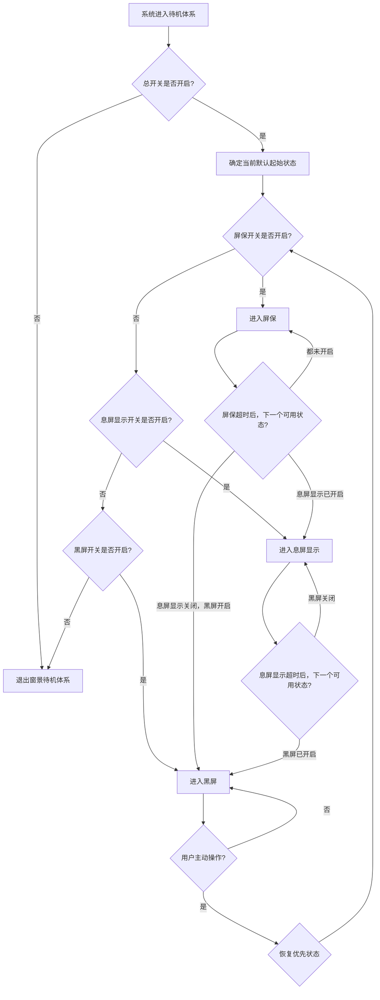

# A500 窗景三层待机状态方案（开关控制版）

> 版本：v1.0  
> 日期：2026-04-20  
> 适用前提：**不接入毫米波 / 不依赖人体存在检测**  
> 方案核心：通过**开关 + 超时 + 用户操作**控制 `黑屏 / 息屏显示 / 屏保` 三层状态

---

## 1. 方案前提

本方案假设：

- **不考虑毫米波、红外、摄像头等存在感知能力**
- 不判断“人是否在场”
- 仅通过以下信号驱动状态切换：
  - 用户操作
  - 无操作时长
  - 时间段策略
  - 用户设置开关

因此，产品逻辑要从“感知型状态机”改为：

> **基于用户配置的层级开关 + 超时降级规则的状态机。**

---

## 2. 重构后的核心思路

### 2.1 核心变化

原先逻辑是：

- 先判断有没有人
- 再判断有没有观看意图

现在改为：

- 先判断**当前允许哪些状态存在**
- 再根据**无操作时长**在允许的状态中逐级降级
- 用户一旦主动操作，再逐级恢复或直接唤醒

### 2.2 一句话定义

> 三层状态不再由“传感器判断”决定，而由“用户开关策略 + 超时规则 + 状态层级”共同决定。

---

## 3. 新的状态层级定义

## 3.1 三层状态

| 状态 | 角色 | 显示强度 | 功耗水平 | 触发方式 |
|---|---|---|---|---|
| 屏保 | 完整内容层 | 高 | 中 | 主动进入 / 开机默认 / 唤醒后恢复 |
| 息屏显示 | 低功耗陪伴层 | 中低 | 低 | 屏保超时降级 |
| 黑屏 | 最终休眠层 | 无 | 最低 | 息屏显示超时降级 |

## 3.2 层级关系

三层状态必须符合单向层级：

```text
屏保
  ↓
息屏显示
  ↓
黑屏
```

用户操作时，状态则反向恢复：

```text
黑屏
  ↑
息屏显示
  ↑
屏保
```

### 3.3 层级原则

1. **屏保是最上层内容态**
2. **息屏显示是中间过渡陪伴态**
3. **黑屏是最终保底休眠态**
4. 下层状态不能脱离上层逻辑独立乱跳

---

## 4. 开关控制模型

## 4.1 产品不再用“是否有人”，改用三类开关

### A. 总开关

控制是否启用“窗景待机体系”。

### B. 状态开关

控制三层中的每一层是否允许进入。

### C. 时间开关

控制每一层在多久无操作后触发。

---

## 4.2 设置结构

建议设置项结构如下：

```text
窗景待机体系
 ├─ 总开关
 ├─ 屏保开关
 │   └─ 屏保进入方式 / 默认时长
 ├─ 息屏显示开关
 │   └─ 从屏保降级到息屏显示的时长
 ├─ 黑屏开关
 │   └─ 从息屏显示降级到黑屏的时长
 └─ 夜间策略
     └─ 夜间是否跳过屏保，直接进入息屏显示/黑屏
```

---

## 5. 状态开关的层级与关联

这是本方案最关键的部分。

## 5.1 三个状态不是平级开关，而是有依赖关系

### 逻辑原则

- **屏保** 是上游状态
- **息屏显示** 是屏保的降级态
- **黑屏** 是息屏显示的降级态

所以三者不能做成完全独立的平级开关，否则会导致逻辑混乱。

---

## 5.2 正确的开关依赖关系

### 方案建议：父子依赖

| 开关 | 是否可独立关闭 | 依赖关系 |
|---|---|---|
| 总开关 | 是 | 关闭后整个体系失效 |
| 屏保开关 | 是 | 是体系入口层 |
| 息屏显示开关 | 是 | 依赖总开关，不强依赖屏保 |
| 黑屏开关 | 是 | 依赖总开关 |

但在状态联动上，需要遵循以下规则。

---

## 5.3 联动规则总表

| 组合 | 是否允许 | 实际表现 |
|---|---|---|
| 屏保=开，息屏显示=开，黑屏=开 | 允许 | 完整三层链路 |
| 屏保=开，息屏显示=开，黑屏=关 | 允许 | 屏保 → 息屏显示，不再进黑屏 |
| 屏保=开，息屏显示=关，黑屏=开 | 允许 | 屏保超时后直接黑屏 |
| 屏保=开，息屏显示=关，黑屏=关 | 允许 | 一直停留屏保 |
| 屏保=关，息屏显示=开，黑屏=开 | 允许 | 无屏保链路，仅息屏显示 → 黑屏 |
| 屏保=关，息屏显示=开，黑屏=关 | 允许 | 长驻息屏显示 |
| 屏保=关，息屏显示=关，黑屏=开 | 允许但意义弱 | 无操作后直接黑屏 |
| 屏保=关，息屏显示=关，黑屏=关 | 不建议 | 等于关闭整个待机体系 |

---

## 5.4 结论：三层不是强依赖，而是有序候选层

更准确的产品定义应该是：

> 系统根据用户开启的状态层列表，按“内容强度从高到低”的顺序逐级降级。

也就是说，系统不强制必须经过所有状态，而是在用户开启的状态中寻找下一个可用状态。

例如：

### 情况 A

- 屏保：开
- 息屏显示：关
- 黑屏：开

则状态机变成：

`屏保 → 黑屏`

### 情况 B

- 屏保：关
- 息屏显示：开
- 黑屏：开

则状态机变成：

`息屏显示 → 黑屏`

### 情况 C

- 屏保：开
- 息屏显示：开
- 黑屏：关

则状态机变成：

`屏保 → 息屏显示`

---

## 6. 可执行状态机逻辑

## 6.1 核心状态机原则

系统启动后，先确定：

1. 用户开启了哪些状态
2. 当前默认起始状态是什么
3. 每层状态的降级时长是多少

然后按“当前状态 → 下一个可用状态”执行。

---

## 6.2 状态机逻辑图



---

## 6.3 可落地状态判断规则

### Step 1：进入待机时，确定起始状态

优先级建议：

```text
若屏保开 → 从屏保开始
否则若息屏显示开 → 从息屏显示开始
否则若黑屏开 → 从黑屏开始
否则 → 不进入窗景待机体系
```

### Step 2：无操作后，向下找“下一个已开启状态”

规则：

```text
当前在屏保
  无操作达到T1
  若息屏显示开 → 转息屏显示
  否则若黑屏开 → 转黑屏
  否则保持屏保

当前在息屏显示
  无操作达到T2
  若黑屏开 → 转黑屏
  否则保持息屏显示
```

### Step 3：用户操作后，恢复到“最高已开启状态”

规则：

```text
当前在黑屏 / 息屏显示
  如果用户有主动操作
  恢复到最高已开启状态：
    屏保开 → 进入屏保
    否则息屏显示开 → 进入息屏显示
    否则保持黑屏或退出体系
```

---

## 7. 开关控制版 PRD

## 7.1 产品名称

`A500 窗景待机状态开关策略`

## 7.2 产品目标

### 用户目标

- 让用户可以按自己偏好决定电视待机时“亮到什么程度”
- 降低复杂感，不依赖传感器也能理解状态变化

### 产品目标

- 建立可配置、可解释、可落地的三层状态体系
- 用设置开关替代复杂感知能力

### 研发目标

- 用最少系统依赖实现稳定状态切换
- 将状态机收敛为“开关 + 定时器 + 用户操作事件”

---

## 7.3 用户故事

### 用户故事 1

作为一个在意氛围的人，  
我希望电视平时先显示完整窗景，过一会儿变成安静的息屏显示，最后再黑屏，  
这样既有氛围，也不会一直亮着。

### 用户故事 2

作为一个很在意省电的人，  
我希望电视不要经过太多状态，  
而是窗景一段时间后直接黑屏。

### 用户故事 3

作为一个喜欢夜间微光陪伴的人，  
我希望关闭黑屏，只保留息屏显示，  
让电视整晚维持低亮陪伴。

---

## 7.4 功能结构

### 功能 1：总开关

#### 说明

控制是否启用整个窗景待机体系。

#### 规则

- 关闭后：
  - 屏保不自动进入
  - 息屏显示不自动进入
  - 黑屏不受本体系控制

#### 默认值

- 开启

---

### 功能 2：屏保开关

#### 说明

控制是否允许进入完整窗景屏保。

#### 规则

- 开启：系统待机起始状态优先为屏保
- 关闭：系统跳过屏保，直接进入下一层可用状态

#### 附属设置

- 屏保降级时间

#### 默认值

- 开启

---

### 功能 3：息屏显示开关

#### 说明

控制是否允许进入低功耗窗景 + 信息组件状态。

#### 规则

- 开启：作为屏保后的第一降级层，或作为默认起始层
- 关闭：系统跳过息屏显示

#### 附属设置

- 息屏显示降级到黑屏时间
- 息屏显示亮度
- 信息组件显示范围

#### 默认值

- 开启

---

### 功能 4：黑屏开关

#### 说明

控制是否允许最终降级到黑屏。

#### 规则

- 开启：成为最后一层休眠态
- 关闭：系统在上一层状态停留，不再继续降级

#### 默认值

- 开启

---

### 功能 5：时间策略

#### 说明

定义每层状态的降级时间。

#### 建议参数

| 参数 | 默认值 | 可选值 |
|---|---|---|
| 屏保降级时间 T1 | 3 分钟 | 1 / 3 / 5 / 10 分钟 / 从不 |
| 息屏显示降级时间 T2 | 10 分钟 | 3 / 5 / 10 / 30 分钟 / 从不 |

#### 规则

- `从不` 表示该层不再自动往下切换
- 如果下一个状态未开启，则直接跳过

---

### 功能 6：夜间策略开关

#### 说明

夜间对三层状态单独做简化控制。

#### 建议选项

| 选项 | 说明 |
|---|---|
| 跟随白天 | 不单独处理 |
| 夜间跳过屏保 | 直接从息屏显示开始 |
| 夜间直接黑屏 | 待机直接进黑屏 |

#### 价值

- 降低夜间打扰
- 减少夜间功耗

---

## 7.5 默认产品策略

建议默认策略采用最平衡方案：

| 设置项 | 默认值 |
|---|---|
| 总开关 | 开 |
| 屏保 | 开 |
| 息屏显示 | 开 |
| 黑屏 | 开 |
| 屏保降级时间 | 3 分钟 |
| 息屏显示降级时间 | 10 分钟 |
| 夜间策略 | 跳过屏保，直接息屏显示 |

这样默认状态链为：

### 白天

`屏保 → 息屏显示 → 黑屏`

### 夜间

`息屏显示 → 黑屏`

---

## 8. 可解释的用户心智

为了让用户理解系统，不建议对外讲“状态机”。

建议产品语言改成：

### 用户可理解的说法

- **完整窗景**
- **低亮陪伴**
- **自动熄屏**

对应关系：

| 用户文案 | 系统状态 |
|---|---|
| 完整窗景 | 屏保 |
| 低亮陪伴 | 息屏显示 |
| 自动熄屏 | 黑屏 |

### 推荐设置页文案

```text
窗景待机
  [开关]

待机时先显示完整窗景
  [开关]

完整窗景后进入低亮陪伴
  [开关]

低亮陪伴后自动熄屏
  [开关]
```

这个表达比直接展示“屏保 / 息屏 / 黑屏”更自然。

---

## 9. 交互与恢复逻辑

## 9.1 用户操作恢复规则

任何主动操作，都恢复到“最高已开启状态”。

| 当前状态 | 用户操作后 |
|---|---|
| 黑屏 | 恢复到最高已开启状态 |
| 息屏显示 | 恢复到最高已开启状态 |
| 屏保 | 保持屏保或进入主界面/业务界面 |

### 最高已开启状态定义

```text
若屏保开 → 恢复屏保
否则若息屏显示开 → 恢复息屏显示
否则若黑屏开 → 保持黑屏
```

---

## 9.2 状态切换动效建议

### 屏保 → 息屏显示

- 先降低亮度
- 再收起动态细节
- 最后显露信息组件

### 息屏显示 → 黑屏

- 信息组件先淡出
- 背景微光后熄灭

### 黑屏 / 息屏显示 → 屏保

- 亮度平滑提升
- 场景补全
- 音频渐入

---

## 10. 研发落地建议

## 10.1 技术实现最小闭环

在没有毫米波的前提下，研发只需处理 3 类输入：

1. 设置开关变更
2. 定时器超时
3. 用户操作事件

输出只有 1 个：

- 切换到哪个状态

因此可将状态机简化为：

```text
StateMachine(
  enabledStates,
  currentState,
  timeoutRules,
  userAction
)
```

## 10.2 状态机伪规则

```text
availableStates = [屏保, 息屏显示, 黑屏] 中用户已开启的状态

initialState = availableStates 中层级最高的状态

onTimeout(currentState):
    nextState = availableStates 中 currentState 下方最近的状态
    if nextState exists:
        switchTo(nextState)
    else:
        keep currentState

onUserAction():
    switchTo(availableStates 中层级最高的状态)
```

---

## 11. 风险与对策

| 风险 | 说明 | 对策 |
|---|---|---|
| 用户看不懂三个状态 | 设置概念过技术化 | 改成“完整窗景 / 低亮陪伴 / 自动熄屏” |
| 开关组合太多 | 容易造成配置复杂 | 给默认推荐值，弱化高级选项 |
| 黑屏关闭后长亮 | 用户忘记自己配置 | 在设置页给出结果预览 |
| 跳过中间层后体验突兀 | 例如屏保直接黑屏 | 增加柔和过渡动画 |

---

## 12. 最终结论

在不考虑毫米波的前提下，A500 三层状态的最合理方案不是继续假装“感知人在不在”，而是：

> **把三层状态做成一个由用户可配置的、有层级顺序的待机链路。**

核心结论有三点：

1. **三层状态必须有层级，但不必强制全开**
2. **状态切换依据不是“人在不在”，而是“当前开启了哪些状态 + 无操作时长”**
3. **系统应始终遵循两个原则：**
   - 无操作时，向下切换到下一个已开启状态
   - 有操作时，恢复到最高已开启状态

这样做的好处是：

- 逻辑足够稳定
- 用户可理解
- 研发非常容易落地
- 后续如接入毫米波，也可在此状态机上平滑升级

