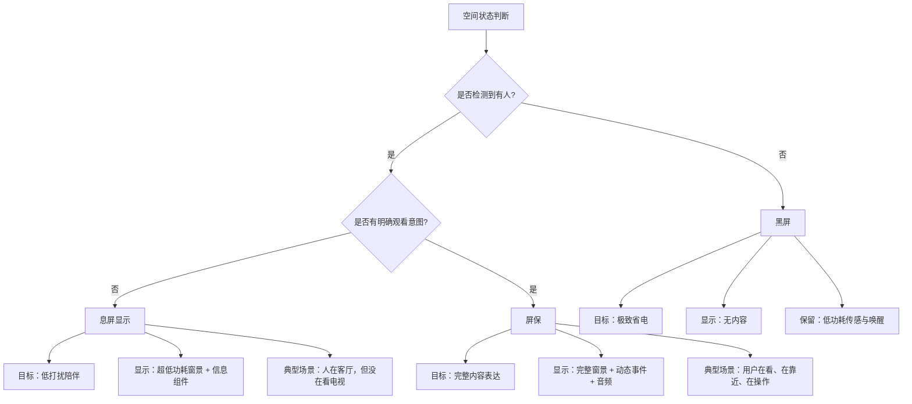
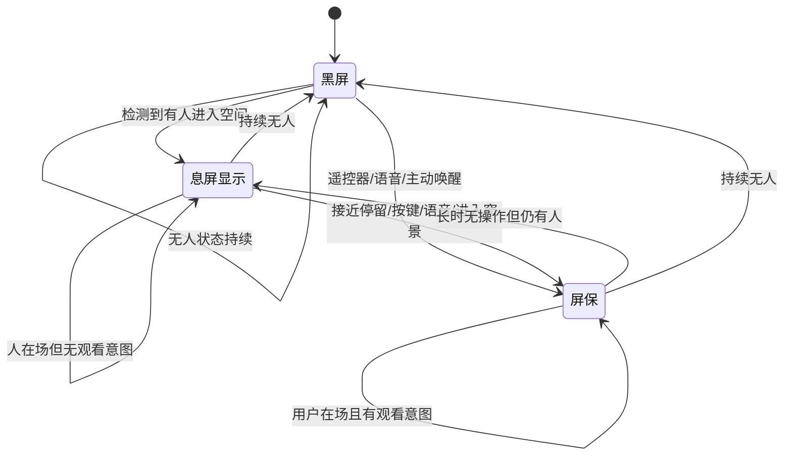
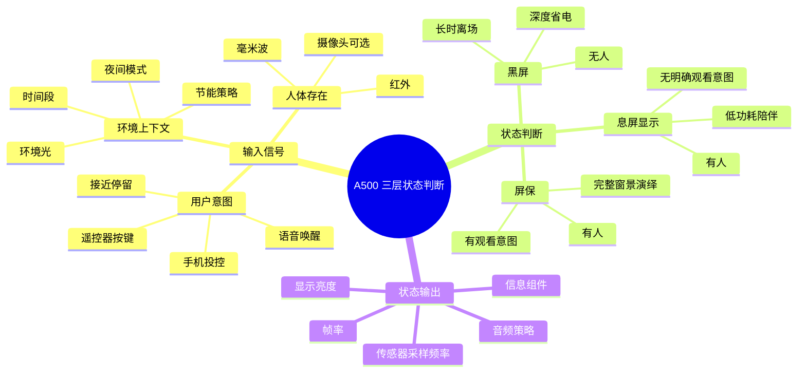

# A500 窗景三层待机状态机逻辑图与 PRD

> 版本：v1.0  
> 日期：2026-04-20  
> 适用产品：A500 窗景电视  
> 适用模块：黑屏 / 息屏显示 / 屏保

---

## 1. 文档目标

本文输出两部分内容：

1. **逻辑思维图**：清晰描述 `黑屏 → 息屏显示 → 屏保` 的状态转换逻辑。  
2. **可落地 PRD**：明确可执行的产品方案、交互规则、参数建议、研发依赖与验收口径。

---

## 2. 一句话方案定义

> A500 基于“是否有人存在”与“是否有观看意图”两条判断线，在黑屏、息屏显示、屏保三层状态之间智能切换。

---

## 3. 逻辑思维图

## 3.1 总体逻辑图



## 3.2 状态转换逻辑图



## 3.3 产品判断逻辑思维图



## 3.4 可执行判断树

```text
Step 1：先判断“有没有人”
  - 若无人 → 黑屏
  - 若有人 → 进入 Step 2

Step 2：再判断“有没有观看意图”
  - 若无明确意图 → 息屏显示
  - 若有明确意图 → 屏保

Step 3：持续动态纠偏
  - 屏保中若长时无操作但人还在 → 降级为息屏显示
  - 息屏显示中若持续无人 → 降级为黑屏
  - 黑屏中若检测到人 → 升级为息屏显示
  - 任一状态中若用户主动唤醒 → 升级为屏保
```

---

## 4. 状态机规则总表

| 当前状态 | 检测条件 | 目标状态 | 说明 |
|---|---|---|---|
| 黑屏 | 检测到人进入空间 | 息屏显示 | 有人但未必想看 |
| 黑屏 | 遥控器/语音/主动唤起窗景 | 屏保 | 明确观看意图 |
| 息屏显示 | 用户靠近并停留 | 屏保 | 从陪伴态升级为内容态 |
| 息屏显示 | 遥控器/语音/手机投控 | 屏保 | 明确操作即升级 |
| 息屏显示 | 持续无人 5 分钟 | 黑屏 | 回归极致节能 |
| 屏保 | 无操作 3 分钟但仍有人 | 息屏显示 | 降低打扰和功耗 |
| 屏保 | 持续无人 1~2 分钟 | 黑屏 | 快速回收显示资源 |

---

## 5. 可落地 PRD

## 5.1 产品名称

`A500 窗景三层待机引擎`

## 5.2 产品背景

传统电视待机只有两种极端：

- 要么完全黑屏，不提供任何空间价值
- 要么持续亮着完整内容，带来功耗和打扰

对于窗景产品来说，这两种都不够合理。  
电视作为“空间设备”，需要像 iOS 全天候显示那样，依据人和场景自动调整存在程度。

因此，本方案引入三层状态：

- **黑屏**：无人时不展示
- **息屏显示**：有人但不打扰
- **屏保**：用户愿意看时完整展开

## 5.3 产品目标

### 体验目标

- 让电视更像“懂空间状态的智能窗”
- 提升人在场时的陪伴感
- 降低无人时无意义亮屏

### 业务目标

- 提升窗景功能的使用频次与日常存在感
- 提升用户对窗景“高级、聪明、节能”的认知

### 技术目标

- 建立可配置的三层状态机
- 支持存在检测、观看意图判断、自动升降级

---

## 6. 用户与场景

## 6.1 目标用户

- 独居用户
- 晚间居家用户
- 重视空间氛围的新中产家庭
- 对真实窗景不满意的城市人群

## 6.2 核心场景

### 场景 A：用户回家进入客厅

- 电视当前为黑屏
- 电视检测到有人后，自动亮起息屏显示
- 用户感知为：电视“知道我回来了”

### 场景 B：用户坐到沙发上，准备看一会儿

- 电视当前为息屏显示
- 用户靠近或按遥控器后，升级为完整屏保
- 用户感知为：窗景“展开了”

### 场景 C：用户离开客厅

- 屏保 / 息屏显示检测到持续无人
- 自动回到黑屏
- 用户感知为：电视不会空房间里白亮着

---

## 7. 功能范围

## 7.1 本期范围

- 三层状态机
- 存在检测接入
- 用户意图检测
- 黑屏 / 息屏显示 / 屏保的显示规则
- 自动升降级逻辑
- 基础设置项

## 7.2 非本期范围

- 多人身份识别
- 成员个性化偏好学习
- AI 自动判断视线方向
- 多设备联动推断在家状态

---

## 8. 功能设计

## 8.1 功能 1：存在检测引擎

### 功能说明

通过设备传感器识别“空间内是否有人”。

### 输入信号

- 毫米波人体传感器
- 红外存在传感器
- 摄像头（可选）

### 输出结果

- 无人
- 有人但远
- 有人且近
- 人在移动
- 人在停留

### 产品规则

- 存在检测优先级高于无操作时长
- 若检测结果不稳定，采用置信度平滑
- 需防止宠物、扫地机等误判

### 建议参数

| 参数 | 默认值 |
|---|---|
| 无人确认时长 | 60 秒 |
| 近距离阈值 | 1.8 ~ 2.5 米 |
| 在场置信度阈值 | 0.7 |

---

## 8.2 功能 2：观看意图判断引擎

### 功能说明

判断用户是否“想看电视上的窗景”。

### 观看意图信号

- 遥控器任意按键
- 语音唤醒
- 用户在近距离停留
- 手机 App 打开窗景
- 从主页主动进入窗景

### 产品规则

- 明确主动操作，直接判定为有观看意图
- 仅有人存在但没有操作，不等于有观看意图
- 接近停留可作为弱意图信号

### 判定优先级

| 信号 | 强度 |
|---|---|
| 遥控器/语音/主动进入 | 强意图 |
| 接近并停留 | 中意图 |
| 远距离存在 | 弱意图 |

---

## 8.3 功能 3：黑屏状态

### 状态定义

无人态、深度省电态。

### 展示规则

- 屏幕全黑
- 不显示信息组件
- 不播放窗景内容

### 进入规则

- 持续无人
- 用户手动关闭显示
- 夜间深度节能策略命中

### 退出规则

- 检测到有人
- 明确唤醒操作

### 产品目标

- 最大限度降低待机能耗
- 让电视在无人时“退场”

---

## 8.4 功能 4：息屏显示状态

### 状态定义

有人在场，但没有明确观看意图时的默认陪伴态。

### 展示规则

- 显示超低功耗窗景
- 显示极简信息组件
- 亮度、帧率、音频都显著低于屏保

### 信息组件范围

- 时间
- 天气
- 温度
- 白噪音 / 睡眠 / 静音状态

### 进入规则

- 黑屏检测到有人
- 屏保长时无操作降级

### 退出规则

- 用户主动操作或靠近停留 → 屏保
- 持续无人 → 黑屏

### 建议参数

| 参数 | 默认值 |
|---|---|
| 亮度 | 5~15 nit |
| 帧率 | 1~5 fps |
| 音频 | 默认关闭 |
| 色温 | 2400K~3200K |

### 体验目标

- 看一眼即可知道时间和状态
- 不会像一台“亮着的电视”
- 更像空间里的一道微光

---

## 8.5 功能 5：屏保状态

### 状态定义

用户在场且具备观看意图时的完整窗景内容态。

### 展示规则

- 完整窗景画面
- 时间/天气/季节同步
- 动态事件
- 故事节奏
- 环境音

### 进入规则

- 从息屏显示升级
- 从黑屏主动唤醒
- 从主页进入窗景

### 退出规则

- 长时无操作但仍有人 → 息屏显示
- 持续无人 → 黑屏

### 建议参数

| 参数 | 默认值 |
|---|---|
| 降级到息屏显示时间 | 3 分钟 |
| 音量 | 20%~35% |
| UI 隐去时间 | 5 秒 |

### 体验目标

- 提供完整的真窗感和氛围感
- 支撑用户停留、观看、感知内容价值

---

## 9. 显示与内容策略

## 9.1 三层内容映射

同一场景需同时具备三种表达：

| 层级 | 内容表达 |
|---|---|
| 黑屏 | 无显示 |
| 息屏显示 | 场景提炼版：轮廓、微光、光点、极简组件 |
| 屏保 | 完整场景版：光影、动态、事件、音频 |

## 9.2 示例：海边小屋

### 黑屏

- 无显示

### 息屏显示

- 保留月光反射
- 一条海平线
- 时间天气组件

### 屏保

- 海浪层叠
- 灯塔微闪
- 海鸥掠过
- 海风与白噪音

---

## 10. 交互流程

## 10.1 黑屏到息屏显示

### 目标

表现为“用户进入空间后，电视温和亮起”。

### 动效建议

- 时长：300~800ms
- 先亮背景轮廓，再亮时间组件

## 10.2 息屏显示到屏保

### 目标

表现为“世界展开”。

### 动效建议

- 亮度平滑提升
- 场景细节补全
- 动态元素渐入
- 音频延迟淡入

## 10.3 屏保到息屏显示

### 目标

表现为“内容收起”。

### 动效建议

- 降低动态频率
- 去除次级细节
- 保留轮廓和信息组件

## 10.4 息屏显示到黑屏

### 目标

表现为“微光熄灭”。

### 动效建议

- 信息组件先消失
- 微光背景后熄灭

---

## 11. 设置项设计

| 设置项 | 说明 | 默认值 |
|---|---|---|
| 无人后进入黑屏时间 | 控制息屏显示保留多久 | 5 分钟 |
| 长时无操作后降级时间 | 屏保降到息屏显示 | 3 分钟 |
| 是否启用息屏显示 | 全局总开关 | 开启 |
| 息屏显示最大亮度 | 控制夜间不刺眼 | 中 |
| 息屏显示信息组件 | 时间/天气/温度/状态 | 全开 |
| 靠近唤醒灵敏度 | 接近多快升级到屏保 | 中 |
| 夜间优先策略 | 夜间优先息屏显示还是黑屏 | 息屏显示 |

---

## 12. 数据埋点建议

| 埋点 | 目的 |
|---|---|
| 黑屏 → 息屏显示次数 | 评估存在检测有效性 |
| 息屏显示 → 屏保转化率 | 评估陪伴态向内容态转化 |
| 屏保平均驻留时长 | 评估内容吸引力 |
| 误唤醒率 | 评估传感稳定性 |
| 黑屏状态时长占比 | 评估省电效果 |
| 息屏显示状态时长占比 | 评估日常陪伴使用频率 |

---

## 13. 研发落地建议

## 13.1 模块拆分

建议研发拆为 5 个模块：

1. 状态机引擎
2. 存在检测接入层
3. 观看意图判断层
4. 三层渲染与内容表达层
5. 配置与埋点层

## 13.2 优先级建议

### P0

- 黑屏 / 息屏显示 / 屏保状态机
- 遥控器/语音触发升级
- 基础超时降级逻辑

### P1

- 人体存在检测
- 靠近停留升级
- 夜间策略

### P2

- 置信度平滑
- 宠物误判优化
- 个性化策略

---

## 14. 风险与解决建议

| 风险 | 说明 | 对策 |
|---|---|---|
| 误判有人 | 宠物/扫地机触发 | 增加持续时间和多信号校验 |
| 误判无人 | 用户静坐导致黑屏 | 毫米波优先，延长无人确认时间 |
| 频繁抖动切换 | 状态来回跳变 | 加滞后策略与最短驻留时间 |
| 夜间过亮 | 息屏显示打扰睡眠 | 限制亮度和色温上限 |
| 屏保降级太快 | 用户觉得“刚看就暗了” | 设置项可调，默认 3 分钟 |

---

## 15. 验收标准

## 15.1 功能验收

- 能正确在三层状态之间切换
- 存在检测和主动操作可正确触发升级
- 持续无人可正确降级到黑屏

## 15.2 体验验收

- 状态切换无闪烁、无突变
- 息屏显示在夜间不刺眼
- 屏保内容在升级后 1 秒内完整可感知

## 15.3 指标验收

- 误唤醒率可控
- 息屏显示到屏保转化率可被监控
- 黑屏时长显著提升省电表现

---

## 16. 结论

三层待机状态不是简单把 AOD 改个名字，而是把窗景电视从“内容播放器”升级为“空间状态感知设备”。

它的本质是：

- **无人时，电视应该退场**
- **有人但不想看时，电视应该低调陪伴**
- **用户想看时，电视才完整展开**

这套状态机既符合家庭空间的真实使用节奏，也具备明确的研发落地路径，适合作为 A500 下一阶段的核心待机方案。

